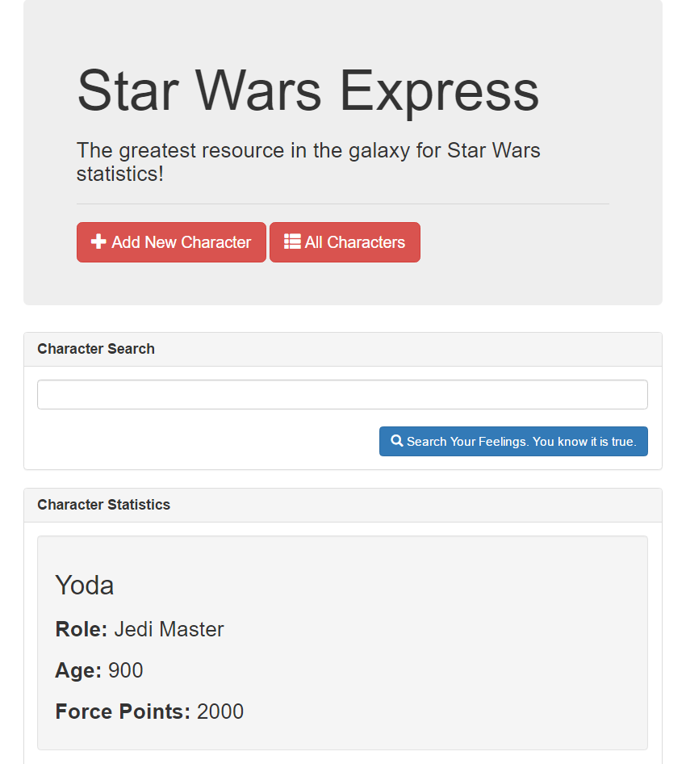
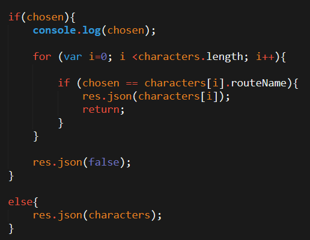
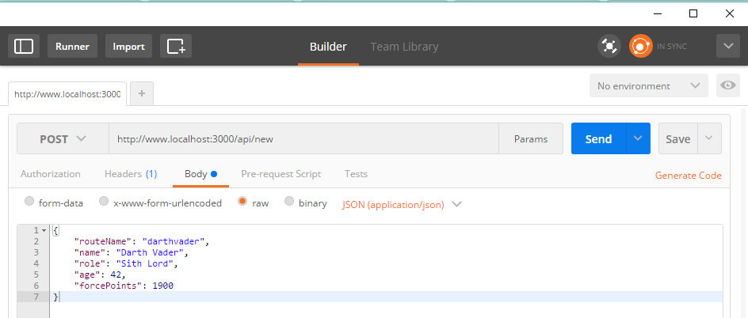
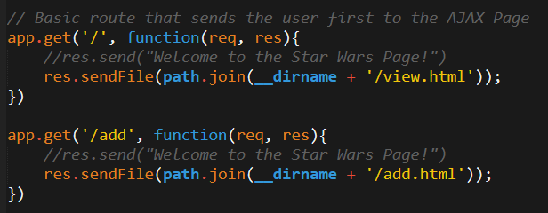

## 13.2 Lesson Plan - Express Yourself

### Overview
Today's class is focused on creating an Express-based web server. Students will be introduced to the concepts of routing, request/response handling, and GET/POST requests.

##### Instructor Priorities:
* Students should understand the basic elements of an Express Server.
* Students should understand the concept of routing along with `app.get()` and `app.post()` syntax.
* Students should know how to target server endpoints using the browser and Postman. 
* Students should be guided through the "Star Wars Express" application.

##### Instructor Notes:

* Welcome back! Today's class along with the next two are some of the most important in the program. Over the course of these three classes you will be walking students through the creation of Node/Express-based APIs and their utilization by front-end interfaces. The general breakdown of classes goes as following
	
	* Today's Class: You will be leading them through a *heavily* guided application build that uses an Express server to house and relay data about various Star Wars Characters [starwars-express.herokuapp.com](http://starwars-express.herokuapp.com). Students will then be left to study this example at home.

	* Next Class: You will be taking off the training wheels and letting them build their own Express application for handling reservation requests. [hot-restaurant.herokuapp.com](http://hot-restaurant.herokuapp.com). This will be extremely challenging to many students, but it's important you give them a chance to work independently here. 

	* Class after: You will be reviewing the previous Hot Restaurant activity during class in-depth. The goal is to give the vast majority of students a firm understanding of the concept, syntax, and utility of creating full-stack web applications with both Front-End and Back-End code.

	* All of their work this week will build up to their homework assignment: [friend-finder.herokuapp.com](http://friend-finder.herokuapp.com). In this homework assignment, they will be creating a server-based "compatibility test" (basically a dating app for friends). The front-end will be composed of a basic survey. The back-end will take survey results, save them, then respond with the person whose results are the closest match. In total, students will have completed 3 different Node and Express applications by the end of the unit.

* Give students a heads-up that today's class is **critical** and that we will be re-examining the concepts from today over the next week.

* Have your TAs reference [13.2-TimeTracker](13.2-TimeTracker.xlsx) to help keep track of time during class. 

-------

### Class Objectives

* To gain a preliminary understanding of the basic elements of an Express server.
* To gain an initial understanding of Express routing.
* To build a first Express-based web application.

--------
### 1	Instructor Do: Welcome		(0:01)
* Begin class by welcoming students. Then open the powerpoint `Express-Slides.ppt`. 

* **Note to Pavan/Mike:** The slides here were part of a more advanced recap. Feel free to cut slides as needed or ditch them if you don't think they will help. Future classes will have the order of content changed slightly.

### 2.	Instructor Do: Quick Recap "Server" Concepts	(0:07)
* Use the slides to help you guide students through a recap of the concepts behind servers. Warn them that this is an extremely important concept and one that will be re-iterated over the next three days. Assure them that it will make sense with  practice and looking over examples again and again over the next few days. 

### 3.	Everyone Do: Introduce Express		(0:02)
* Use the slides to introduce the concept of the Express framework and routing. 

* At one point in the slideshow you will be pointed to the Mean Map App website. Remind students how the webpage works (namely that the site lets users register and then add themselves to our map). Then use the proceeding slides to discuss the concept of GET and POST routes. Give them a heads-up that we'll be able to use AJAX and jQuery to make both these types of communications. 

### 4.	Instructor Do: Demo basic routing with server1.js	01-BuildUp	(0:05)
* From this point forward, you will be opening each of the server.js files inside of `01-BuildUp`. 

* Before you start working with the code go to the link: [starwars-express.herokuapp.com](http://starwars-express.herokuapp.com) and show students how the page works. Essentially, you can type in a Star Wars Character's name and search the "database" to see his/her properties. You can also add characters to the database using the simple form. Add a character and show how it gets displayed on both the page and the API. 



* To show the API you can simply go to this link: [http://starwars-express.herokuapp.com/api](http://starwars-express.herokuapp.com/api). The api also accepts an additional parameter at the end in the form of http://starwars-express.herokuapp.com/api/charactername. As an example: [http://starwars-express.herokuapp.com/api/yoda](http://starwars-express.herokuapp.com/api/yoda).

* Now open the file `server1.js` (`01-BuildUp`). Walk students through the general gist of the code. Don't get caught up in sections that are not directly commented like `bodyParser` at this point. In the next two classes, you will be drilling down into the details. *For now the key focus is to give them an understanding of express(), routing, and the listener*.

* Run the `server1.js` file and show them how it works. (Don't forget to talk about `npm install`). 

* Once you've discussed the key pieces proceed to the first activity. 

### 5.	Students Do: Add Route to server1.js	01-BuildUp	(0:07)

* Slack out the following file and instructions:

* **File:**

	* `server1.js` (`01-BuildUp1`)

* **Instructions:**
	
	* Work with those around you to confirm your `server1.js` file working. This means figuring out: what dependencies to install, how to run the file, and how to view the resulting website in your browesr. This step requires you to make ZERO changes to the code file. At this point, you are just getting the file you are given to run.

	* Then, once you've gotten the original code to display in browser add code to the file so that a new route for Obi Wan Kenobi. Use the comments and the previous code in the file as a guide. 

	* Help those around you when done. 

### 6.	Instructor Do: Review Previous Activity		(0:05)

* Review the previous activity by coding it out yourself. Your solution should look like something of the below:

```
var obiwankenobi = {
	name: "Obi Wan Kenobi",
	role: "Jedi Knight",
	age: 42,
	forcePoints: 1350
}

app.get('/obiwankenobi', function(req, res){
	res.json(obiwankenobi);
})

```
### 7.	Partners Do: Dissect req.params (server2.js)		(0:05)
* Next slack out the following file and instructions.

* **File:**

	* `server2.js` (`01-BuildUp1`)

* **Instructions:**
	
	* Examine the code sent to you. Once again, run the `server2.js` file and view the page in the browser. Troubleshoot any issues that arise. Again NO CODE CHANGES required.

	* Then once you have a working server instance, begin to examine the file. Try to explain to yourself and those around you what the significance of `/:characters` and `req.params.characters` is.

	* Create a test case to check your hypothesis. 

### 8.	Instructor Do: Review Previous Activity		(0:03)

* Have students try to explain to you what they found.

* If no one offers the correct answer, explain that the `/:characters` syntax is a way of saying we have a "variable" parameter in the URL route. Show them via the browser that this means they can search for a given character using the URL and it will display in the console.


### 9.	Partners Do: Dissect Parameter Match (server3.js)		(0:05)

* Now slack out the next file:

* **File:**

	* `server3.js` (`01-BuildUp1`)

* **Instructions:**
	
	* Examine the code flagged in the comments. Explain to those around you what it does and how it works. Be sure to create test cases that confirm your hypothesis.

### 10.	Instructor Do: Review Previous Activity		(0:05)
* Use the same process as before to ask students to explain the for-loop concept to you. 

* If no one offers the correct answer, explain that this for-loop "checks" which character is being sought after in the URL -- then finds that character's information and re-displays it back to the user in the form of a JSON. 



* Show them how this works by searching for the character `yoda`. Then try searching for a non-existent character like `hansolo`.

* Ask students of an example where this concept of routing where the URL is changing might be found. (suggested answer: Newspapers. Every newspaper has a url like `/2016/01/01/Great-story-of-the-day` )

### 11.	Instructor Do: Re-demonstrate server4.js		(0:10)

* If needed, open the file `server4.js`. This file simply includes a line-by-line commenting of the previous example. Slack out this file to students so they can look over it during the next few exercises.  

### 12.	Instructor Do: Show code for Post Route (server5.js)		(0:07)

* Now open the file `server5.js`. In this example, simply point students through the fact that we've created a new POST route. Explain that this route will take in JSON inputs then DO work with them. In this case it will save the JSON to the database and return a JSON of the new character.


### 13.	Students Do: req.body dissection (server5.js)		(0:05)

* Now slack out the following file and instructions.


* **File:**

	* `server5.js` (`01-BuildUp1`)

* **Instructions:**
	
	* Spend a few moments researching what `req.body` means in the context of Express and how you can POST data to the Express server. 

### 14.	Instructor Do: Postman Demo		(0:07)

* Have students articulate their answers before going having them install the program Postman.  [https://www.getpostman.com/](https://www.getpostman.com/). We'll be using Postman so both windows users and mac users can be taught how to send POST requests using the same program.

* Walk students through the process of sending POST requests in Postman. If you are unfamiliar use the following points as a guide:

	* Run your server instance.

	* Open Postman.

	* Select POST in the dropdown next to the link. Then enter the URL of your server's POST route.

	* Then click the button: "Body". Click the setting "Raw". Then hit the dropdown that says "Text" and click JSON.

	* Enter in a complete JSON. You can use:

		```
		{
		"routeName": "darthvader",
		"name": "Darth Vader",
		"role": "Sith Lord",
		"age": 42,
		"forcePoints": 1900
		}
		```

	* Hit "Send"

	* Now check back to your Star Wars API to confirm that Postman received the request body.

* 

### 15.	Students Do: Postman Exercise		(0:07)
* Now have students perform the same exercise with their own servers.

* You can slack out the following file and instructions:

* **File:**
	
	* `server5.js`

* **Instructions:**

	* Use Postman to send a POST request to the server you've been provided. Confirm that your character has been added to the database correctly. 

--------
### 16.	Break		0:15
--------

### 17.	Instructor Do: Demo sendFile (server6.js + view.html)		0:10

* Open the file `server6.js`. Look at the line under the `app.get('/')` route. Point out to students the use of the `res.sendFile` code. This code is used to send users a specific HTML file in response to their visiting a route. 




* Be sure to point out how we make use of the `path` npm package to empower our server to know where the file is located.

### 18.	Students Do: Dissect .get view.html		(0:07)

* **File:**
	
	* `server6.js`

* **Instructions:**

	* Look at the file sent to you then explain to the person next to you what the `res.sendFile` line does. Then try creating a new HTML file and routing to that one instead.  

### 19.	Instructor Do: Review Activity		(0:07)

* Review the previous exercise and answer any questions. Try to get students to think about the distinction between routing users to "data" and routing them to rendered "HTML" pages. Try to get them to think about when you would use `res.json` and when you would use `res.sendFile`.

### 20.	Instructor Do: Demo Complete Application	02-FinalApp	(0:06)

* Open the completed application found in `02-FinalApp`. Walk students through the overall folder structure and how there is a mix of the `server.js` file and the HTML files which will be relayed to users. Also point out how we have a new `add.html` file. 

### 21.	Students Do: Dissect .post (add.html)		(0:07)

* Slack out a zipped copy of `02-FinalApp`. Then task students with the following:

* **Instructions:**
	
	* Spend a few moments looking over the code sent to you. First, get the server running, then begin to dissect the javascript code found at the bottom of `add.html`. 

	* Explain to one another what the code does, what its for, and why its relevant to the application so far. Be sure to explain to one another what the `$.post` code is doing.

### 22.	Instructor Do: Review Activity (add.html)		(0:07)
* Walk students through the meaning of the Javascript in `add.html`. Go line by line and explain how jQuery is used to grab the values in the form -- then immediately POSTs these values to the API. The API then saves the records into the database.

* Answer any questions that remain.

### 23.	Partners Do: Create an "all characters page"	03-ExtendedApp	(0:40)

* If time permits, task students with the below activity:

* **File:**
	* `02-FinalApp` (Zipped)

* **Instructions:**
	* Create a new page on your Star Wars website that displays a table of ALL characters in the database. This will involve at minimum:

		* Creating a route in the server.js file for displaying data 

		* Creating a route in the server.js file for sending users a new HTML file

		* Creating an HTML file that grabs data from the server. 

### 24.	Instructor Do: Review Activity		(0:07)
* Review the activity by running the server found in `03-ExtendedApp`. Walk students through the changes described above in each of the files

### 25.	Instructor Do: Introduce Homework		(0:05)
* Finally, point students to the homework activity. For this activity, students will be creating a compatibility test like the one found here: [friend-finder.herokuapp.com](http://friend-finder.herokuapp.com).

-------

### Copyright
Coding Boot Camp (C) 2016. All Rights Reserved.
