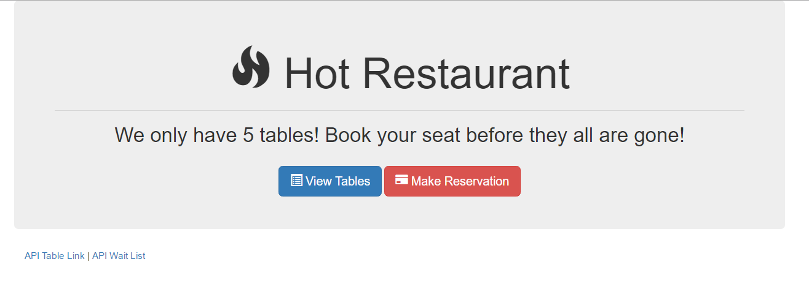
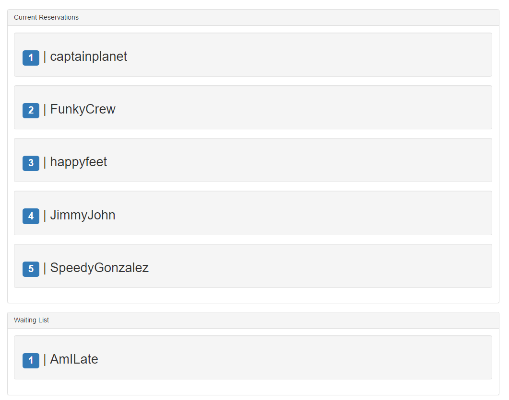
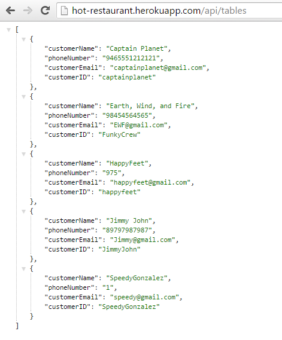
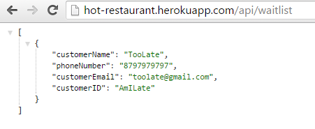

## 13.3 Lesson Plan - Hot Restaurant Activity

### Overview
Today, we'll be asking students to create an Express based web application for handling reservation requests. In the process of building today's assignment, students will reinforce their understanding of Express Servers, Routing, and the utility AJAX for front-end interaction. 

##### Instructor Priorities:
* Students should be given the entire class to create today's activity. 
* As much as possible, focus on providing students assistance in small-group format. 

##### Instructor Notes:

* Welcome back! Today's class will be one of the more challenging ones for students, as we will be pushing them to use their rudimentary skills with Node/Express to create a real-world application. The focus for the day is to immerse them in a build-it-first approach to learning. 

* Stronger students will find today's class refreshing because of the challenge, but weaker students may walk out fairly confused. 

* The emphasis for today's class is to let students drive and to assist them in *small groups*. Don't try to overly "walk" the entire class through the app via lecture today. Take the podium when necessary, share code when appropriate, but try to spend more of your time working with individual groups. What you will quickly find is that groups are in dramatically different places and often working through very specific issues. You will have the next class to go through the activity more formally. 

* Towards the end of class, let all students know that the next weekday class will be devoted to a thorough re-examination of the solution.  

* Throughout today's class, constantly encourage students to look back at the previous activity from class on the Star Wars Express application. 

* Have your TAs reference [13.3-TimeTracker](13.3-TimeTracker.xlsx) to help keep track of time during class. 

-------

### Class Objectives

* To create a real-world application for handling reservations using Node/Express

--------
### 1.	Instructor Do: Welcome	(0:10)

* Welcome students to class. 

* Then when everyone get's settled give students a few moments to ask high-level questions regarding the previous class. 

* Let students know that the concepts covered this week regarding Node and Express servers are some of the most important concepts in the class. Let them know that it really gets to the heart of what full-stack web development is -- and for this reason, it's important they push themselves to learn it now. 

* Strongly suggest that students take some time with this stuff to check out a few key external resources. Particularly, Code School's content on Express: [https://www.codeschool.com/courses/building-blocks-of-express-js](https://www.codeschool.com/courses/building-blocks-of-express-js). (**STRONGLY RECOMMEND THIS**).

* Slack out the below resources:

	* [https://www.codeschool.com/courses/building-blocks-of-express-js](https://www.codeschool.com/courses/building-blocks-of-express-js)

	* [https://scotch.io/tutorials/use-expressjs-to-get-url-and-post-parameters](https://scotch.io/tutorials/use-expressjs-to-get-url-and-post-parameters)

	* [https://scotch.io/tutorials/build-a-restful-api-using-node-and-express-4](https://scotch.io/tutorials/build-a-restful-api-using-node-and-express-4)

### 2.	Instructor Do: Demo End Application	(0:15)

* Then begin to remind students that the best way to learn to code -- especially challenging concepts -- is sometimes just to force yourself to code. For this reason, today's class will be a 4-hour session in which you'll be building a real-world application that makes use of the concepts we're covering so far. 

* Slack out the following link: [hot-restaurant.herokuapp.com](http://hot-restaurant.herokuapp.com). 

* Then ask all students to make a Reservation request on the website. 

* Once they are done, visit the page: [http://hot-restaurant.herokuapp.com/tables](http://hot-restaurant.herokuapp.com/tables). Point out how their reservation requests have been captured and listed on the site. Depending on whether or not they were one of the first five requests, they were added to the reservation list -- otherwise they were put on the waitlist. 

* Then take a few moments to flip through the screens. Point out how there is a page for creating reservations, a page for viewing reservations, and two pages for viewing JSONs of the current reservations and waitlisted parties. 

* Let students know that they will be building this application from scratch over the course of the next few hours. 

### 3.	Instructor Do: Group Formation + Initial Instructions	(0:10)

* Have students divide themselves into groups of 4 (with 2 members from each section). 

* Then slack out the following instructions:

* **Instructions:**

	* Today you will be building a Node / Express based web applications for handling reservation requests. 

	* Your application will be made up of two parts: 1) A front-end set of HTML/CSS/JS pages for entering and viewing data and 2) A back-end composed of Node/Express and basic JS for storing, updating, and relaying reservation data.

	* Spend the time necessary to map this application out. Consider the concepts we've covered in class so far: 

		* Servers
		* Routing
		* APIs
		* AJAX (GET and POST Requests)

	* You should be referencing the code from the previous Star Wars application.

	* Feel encouraged to use the following application as a reference: [http://hot-restaurant.herokuapp.com/](http://hot-restaurant.herokuapp.com/)

	* Note: We know this is a hard activity. We know you aren't yet comfortable with Node or Express. But push yourself. The best way to learn is to push through the discomfort and BUILD! Ask for help when you need it. We're here to help you through the process.

	* **Bonus:**

		* If by some miracle you finish early, feel encouraged to work on any one of these additional tasks to take your application to the next level.

			* Add code to your server so that it "counts" every time a person visits any of the pages. Display a running count on the website. 

			* Add buttons for "checking off" individuals from the reservation list. Once this happens, the next person on the waitlist should be addd to the main reservation list.

			* Add a button for sending emails to individuals on the wait-list letting them know they have a table ready. You will need to use node-mailer or a similar npm package to make this work. (A hard task, but very cool).

			* Add a button for sending text messages to individuals on the wait-list letting them know they have a table ready. You will need to use the Twilio library to make this work. (A hard task, but very cool). 

* Let them know that you will be providing them with guidance on how to proceed every 20 minutes or so. 

### 4	Partners Do: Phase I - Pseudocode (0:15)

* For this first phase, slack out the following instructions:

* **Instructions:**

	* Phase I: For this first phase, aim to write out the pieces that will need to be programmed to create the functionality of your application. Try to break it into 6-7 pieces.

* **Instructors/TAs:** Once time is up have students share their breakdowns. As a suggestion, here is a list that you can slack them. 

	* Create the front-end (visuals) for home page, reservation form, and reservation views.

	* Create a basic server using Express.JS

	* Create a few array variables that will hold the data

	* Create a set of routes for getting and posting table data

	* Create a set of routes for displaying the HTML pages

	* Use jQuery to run AJAX calls to GET and POST data from users to the Express server

### 5.	Partners Do: Phase II - Frontend + Server Creation (0:20)
* Proceed with the next phase. Slack out the following instructions to help guide them:

* **Instructions:**

	* Phase II: For this second phase, aim to complete the following:

		* Backend Team: 
			* Create a basic Express server. 

			* Your server at this point should do the BARE MINIMUM. (Effectively, it should just say: "Listening at PORT 3000" when the command `node server.js` is run.)

		* Frontend Team:
			* Create three HTML files one called `home.html`, another called `tables.html`, and another called `reserve.html`. Use dummy data and create pages similar to the one shown to you on the sample Hot Reservation webpage.

		* All: If you finish early, begin thinking about how the Data, API, and Routes should look.

* **Instructors/TAs:**

  * Have students who accomplished this task share their code with you (via GitHub) and display it on screen. Then have them come up and talk about what they did. 

### 6.	Partners Do: Phase III - API Routing + Frontend Delivery (0:40)
* Proceed with the next phase. Slack out the following instructions to help guide them:

	* Phase III: For this third phase, aim to complete the following:

		* Backend Team: 
			* Create a set of variables (hint: arrays of objects) for holding the reservation and waitlist data 

			* Create a set of routes that then display this data as JSONs. Users should be given these JSONs if they visit the appropriate page (i.e. if a user visits `localhost:3000/api/tables` they should see a JSON of table data).

		* Frontend Team:
			* Temporarily join the backend team. Your task will be to create Express routes that display your HTML pages when a user visits the appropriate page. (i.e. if a user visits `localhost:3000/tables`... they should be shown the `table.html` page.) 

			* If you finish early begin creating the code necessary to convert your form data into JSON objects. 

--------
### 7.	Break		(0:40)
--------

### 8.	Partners Do: Phase IV - Backend Logic + AJAX (1:00)
* Proceed with the next phase. Slack out the following instructions to help guide them:

	* Phase IV: For this fourth phase, aim to complete the following:

		* Backend Team: 
			* Create the logic that handles reservation requests. Your code should work such that POST requests take in JSON objects, checks if there is any space left, then adds the JSON object to either the reservation array or the waitlist array. Your POST route should also respond to requests with a confirmation (true or false) of whether or not the requestor has a reservation (or is on the waiting list).

			* You should be using Postman to do all your testing at this point.

		* Frontend Team:
			* Begin to do serious research on AJAX. Specifically, focus your attention on how AJAX can be used to do both GET and POST requests. 

			* Then create the necessary code on your `tables.html` page such that it can retrieve data from the Backend Team's API. In essence you will be creating an AJAX GET request to retrieve the data.

			* Then create the necessary code on your `reserve.html` page such that it can send data to the Backend Team's API. In essence you will be creating an AJAX POST request to send the data. 

		* All: This is the most challenging part of today's activity. Be persistent! You can do this!
	
### 9.	Partners Do: Phase V - De-bugging + Bonus (0:20)
* Proceed with the final phase. Slack out the following instructions to help guide them:

	* Phase V: For the fifth and final phase, aim to complete the following:

		* All: 

			* Complete any remaining functionality from the previous phase if you need more time. 

			* Then, thoroughly test your application for bugs. Check if there are any obvious ways to crash the application. 

			* Then, if you have more time -- begin to tackle any bonus of your choice. 

### 10.	Instructor Do: Recap + Closing Thoughts (0:10)
* Take the stage again. Let students know that this was a hard activity but an incredibly realistic one. 

* Encourage them by informing them that they've reached a highly significant (and lucrative) point in their coding careers. Being able to build front-end and back-end applications like this one will allow them to build any number of applications. 

* Then let them know that -- because of how important it is to understand these concepts, we will be thoroughly examining the solution, as a class next week. 

* Slack out the solution and HIGHLY HIGHLY encourage them to review it on their own. Let them know that the code has been thoroughly commented and that they should consider working in groups to dissect it. 

* Again recommend Code School as a great resource for cementing their understanding of this stuff.

* Finally, say something funny -- then call it a day. You've done some great educating today! :-) 

-------

### Copyright
Coding Boot Camp (C) 2016. All Rights Reserved.
